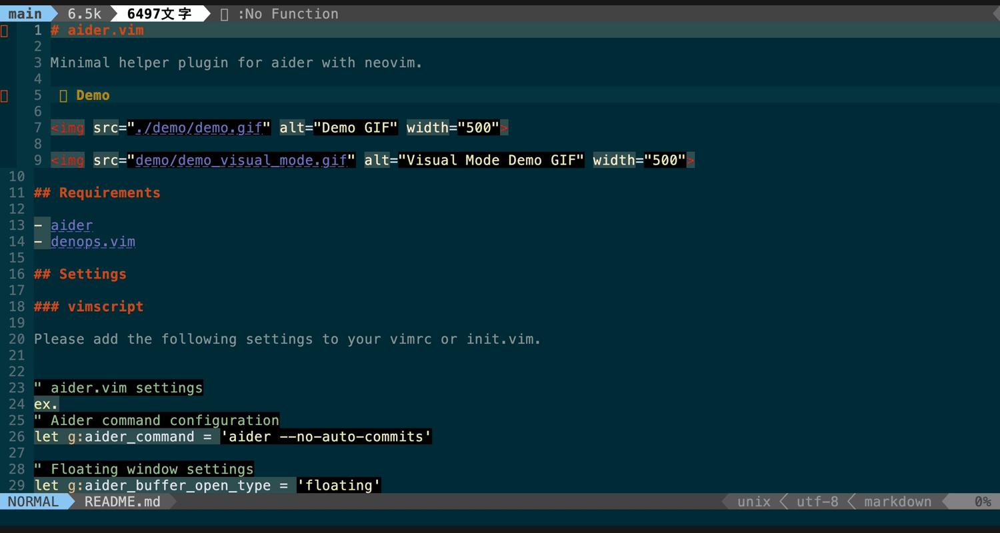
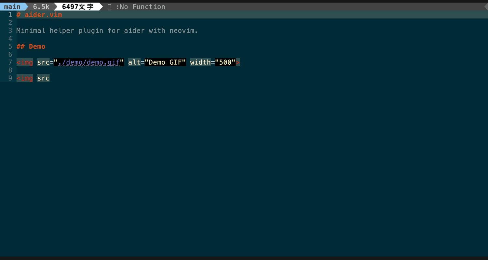
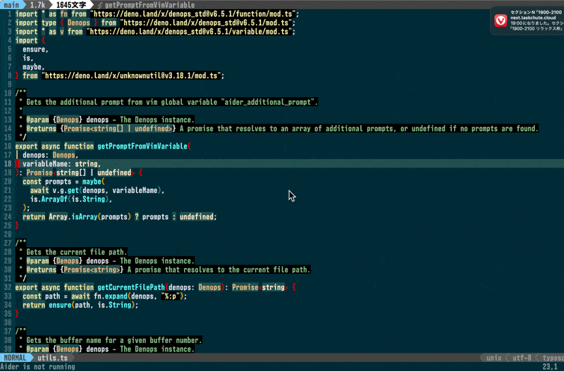

# Aider.vim

A minimal helper plugin for using [aider](https://github.com/Aider-AI/aider) with
Neovim.

## Demo

You can invoke Aider from Vim


You can send the selected range to Aider as context



You can send the current buffer to Aider as context



You can send voice commands to Aider using Whisper


## Requirements

- [aider](https://github.com/paul-gauthier/aider)
- [denops.vim](https://github.com/vim-denops/denops.vim)

## Settings

### vimscript

Add the following settings to your `vimrc` or `init.vim`:

```vim
" `Aider.vim` settings
" Aider command configuration
let g:aider_command = 'aider --no-auto-commits'

" Floating window settings
let g:Aider_buffer_open_type = 'floating'
let g:Aider_floatwin_width = 100
let g:Aider_floatwin_height = 20
let g:Aider_floatwin_border = "double"
let g:Aider_floatwin_border_style = "minimal"

" Additional prompt settings
let g:Aider_additional_prompt = [
  " Your additional prompt here.",
  " This will be displayed in the floating window when using visual mode selections.",
  " You can see and edit it before sending to Aider.",
]

" Key mappings
nnoremap <silent> <leader>at :AiderRun<CR>
" Add current file to Aider context
nnoremap <silent> <leader>aa :AiderAddCurrentFile<CR>
" Add current file as read-only to Aider context
nnoremap <silent> <leader>ar :AiderAddCurrentFileReadOnly<CR>
" Add content from a URL to Aider context
nnoremap <silent> <leader>aw :AiderAddWeb<CR>
" Exit Aider
nnoremap <silent> <leader>ax :AiderExit<CR>
" Add current file to Aider's ignore list
nnoremap <silent> <leader>ai :AiderAddIgnoreCurrentFile<CR>
" Open Aider's ignore list
nnoremap <silent> <leader>aI :AiderOpenIgnore<CR>
" Paste content from clipboard into Aider context
nnoremap <silent> <leader>ap :AiderPaste<CR>
" Hide Aider window
nnoremap <silent> <leader>ah :AiderHide<CR>
" Hide Aider window in terminal mode
tnoremap <C-x><C-x> <C-\><C-n>:AiderHide<CR>
vmap <leader>av :AiderVisualTextWithPrompt<CR>

" Autocommand group for Aider
augroup AiderOpenGroup
  autocmd!
  autocmd User AiderOpen call s:AiderOpenHandler()
augroup END

function! s:AiderOpenHandler() abort
  " Set key mappings for the Aider buffer
  tnoremap <buffer> <Esc> <C-\><C-n>
  nnoremap <buffer> <Esc> :AiderHide<CR>
endfunction
```

### lua (lazy.nvim)

Add the following settings to your lazy.nvim configuration:

```lua
{ "nekowasabi/aider.vim"
  , dependencies = "vim-denops/denops.vim"
  , config = function()
    vim.g.aider_command = 'aider --no-auto-commits'
    vim.g.Aider_buffer_open_type = 'floating'
    vim.g.Aider_floatwin_width = 100
    vim.g.Aider_floatwin_height = 20

    vim.api.nvim_create_autocmd('User',
      {
        pattern = 'AiderOpen',
        callback =
            function(args)
              vim.keymap.set('t', '<Esc>', '<C-\\><C-n>', { buffer = args.buf })
              vim.keymap.set('n', '<Esc>', '<cmd>AiderHide<CR>', { buffer = args.buf })
            end
      })
    vim.api.nvim_set_keymap('n', '<leader>at', ':AiderRun<CR>', { noremap = true, silent = true })
    vim.api.nvim_set_keymap('n', '<leader>aa', ':AiderAddCurrentFile<CR>', { noremap = true, silent = true })
    vim.api.nvim_set_keymap('n', '<leader>ar', ':AiderAddCurrentFileReadOnly<CR>', { noremap = true, silent = true })
    vim.api.nvim_set_keymap('n', '<leader>aw', ':AiderAddWeb<CR>', { noremap = true, silent = true })
    vim.api.nvim_set_keymap('n', '<leader>ax', ':AiderExit<CR>', { noremap = true, silent = true })
    vim.api.nvim_set_keymap('n', '<leader>ai', ':AiderAddIgnoreCurrentFile<CR>', { noremap = true, silent = true })
    vim.api.nvim_set_keymap('n', '<leader>aI', ':AiderOpenIgnore<CR>', { noremap = true, silent = true })
    vim.api.nvim_set_keymap('n', '<leader>ap', ':AiderPaste<CR>', { noremap = true, silent = true })
    vim.api.nvim_set_keymap('n', '<leader>ah', ':AiderHide<CR>', { noremap = true, silent = true })
    vim.api.nvim_set_keymap('v', '<leader>av', ':AiderVisualTextWithPrompt<CR>', { noremap = true, silent = true })
  end
  }
```

## Usage

To use Aider.vim, you can run the following commands within Vim or Neovim:

`Commands containing "Silent" in their name send commands to Aider without focusing the Aider buffer.`

- `:AiderRun` - Runs aider or displays the Aider window.
- `:AiderAddCurrentFile` - Adds the current file to Aider's context.
- `:AiderAddCurrentFileReadOnly` - Adds the current file as read-only to Aider's
  context.
- `:AiderAddBuffers` - Adds all currently open, Git-tracked buffers to Aider's context.
- `:AiderSilentAddCurrentFile` - Adds the current file to Aider's context and refreshes the buffer, without focusing the Aider buffer.
- `:AiderSilentAddCurrentFileReadOnly` - Adds the current file as read-only to Aider's context, without focusing the Aider buffer.
- `:AiderExit` - Exits aider and cleans up the session.
- `:AiderVisualTextWithPrompt` - Edit the selected text (visual mode) in a floating window and send it to Aider. In the floating window, send to Aider with `<CR>` (normal mode) or close the window with `Q`. You can also back up the prompt using `q`.
- `:AiderAddPartialReadonlyContext` - Adds the selected text (visual mode) as read-only context to Aider.
- `:AiderAddWeb` - Prompts for a URL and adds its content to the Aider context.
- `:AiderOpenIgnore` - Opens the `.aiderignore` file from the Git repository root, if it exists.
- `:AiderAddIgnoreCurrentFile` - Adds the current file to the `.aiderignore`.
- `:AiderSendPromptByCommandline <prompt>` - Sends the given `<prompt>` from the command
  line and displays the Aider window.
- `:AiderSilentSendPromptByCommandline <prompt>` - Sends the given `<prompt>` from the
  command line and refreshes the buffer, without focusing the Aider window.
- `:AiderAsk <question>` - Sends the given `<question>` to aider without adding any files to
  the context.
- `:AiderHide` - Hides the floating window and reloads the buffer.
- `:AiderPaste` - Pastes the content from the clipboard into the Aider context.
- `:AiderHideVisualSelectFloatingWindow` - Hides the floating window used for visual mode selections.
- `:AiderVoice` - Sends voice commands to Aider (using Whisper).

### Advanced Usage

To send a custom prompt to Aider, use the
`AiderSendPromptByCommandline` command. Here's how to set it up:

```vim
" Send a prompt to Aider and display the Aider window.
:AiderSendPromptByCommandline "/chat-mode architect"

" Send a prompt to Aider without displaying the Aider window.
:AiderSilentSendPromptByCommandline "/chat-mode code"
```

## Additional Prompt

You can set an additional prompt that will be automatically added to every
interaction with Aider. This is useful for setting consistent rules or
guidelines for the AI.

To use this feature, set the `g:Aider_additional_prompt` variable in your `vimrc`
or `init.vim`:

```vim
let g:Aider_additional_prompt = [
  "Your additional prompt here",
  "This will be displayed in the floating window when using visual mode selections",
  "You can see and edit it before sending to Aider",
]
```

This prompt will be displayed in the floating window when using visual mode
selections, allowing you to see and edit it before sending to Aider.

## ddu Source

Aider.vim provides a ddu source and kind, allowing you to easily select
files from your Git repository and add them to the Aider context.

To use this feature, you need to have
[ddu.vim](https://github.com/Shougo/ddu.vim) installed.

Here's an example configuration for your ddu settings:

```vim
call ddu#custom#patch_global({
    \ 'sources': [{'name': 'Aider'}],
    \ 'sourceOptions': {
    \   'Aider': {'matchers': ['matcher_substring']},
    \ },
    \ 'kindOptions': {
    \   'Aider': {
    \     'defaultAction': 'add',
    \   },
    \ },
    \ })

nnoremap <silent> <Leader>ad
      \ <Cmd>call ddu#start({'sources': [{'name': 'Aider'}]})<CR>
```

With this configuration, you can press `<leader>ad` to open ddu with the Aider
source. You can then select files and press `<CR>` to add them to the Aider
context.

### DEMO



## Acknowledgements

The aider CLI tool was created by [Paul Gauthier](https://github.com/paul-gauthier).
